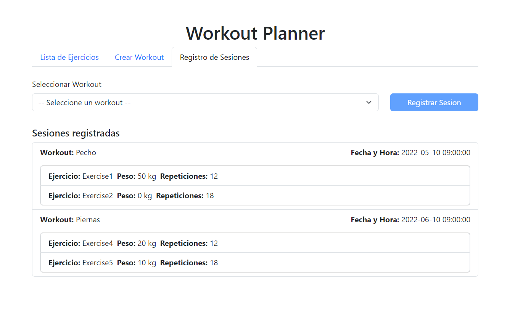

# Workout Planner

Workout Planner is a SAAS under the SPA model, which allows you to create your own routines and track them from the comfort of your web browser. It is easily intuitive and navigable.

## Features

- Software developed in: `JavaScript + HTML + CSS + Bootstrap.`
- Application of OOP (Object-Oriented Programming) and SOLID principles.
- Note: The software is not connected to a real database; all created records will be immediately deleted upon refreshing the browser.

## Set up

- Select the HTML index file within the `./src` folder and run it with any real-time local development server such as: `Live Server` or `Live Preview`.
